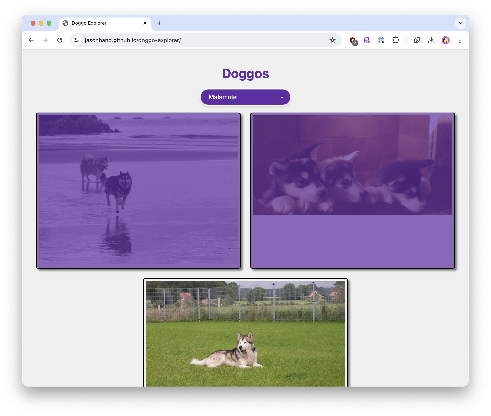

# Doggo Explorer
HTML, Javascript, and CSS app that calls the Dog API (https://dog.ceo/dog-api/documentation/)

## How to Use This Project

1. Fork this repository.
2. From the root directory, run `python -m http.server 8001` to start a web server on your local machine.
3. Browse to `http://localhost:8001/` in your browser to view the application.

>NOTE: Python must be installed locally.

This demo is used to demonstrate adding RUM (real user monitoring) to a basic Javascript, HTML, and CSS deployment. 

## Resources

- [RUM Browser Monitoring](https://dtdg.co/gcn24_RUM)
- [Browser Log Collection](https://dtdg.co/gcn24_browser_logs)
